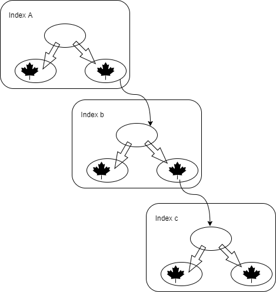
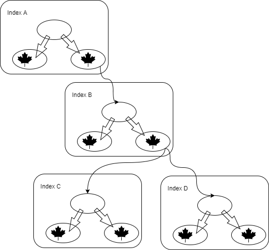

# Thoughts about data structure

I suppose anyway it should be some tree-like structure.
As far as I understand, when we are creating a multi-column index each leaf node contains reference to the next column tree.
For example if we have index on columns A, B and C 

 

Each leaf contains reference to another column's index, for example leafs of A have reference to B and B have reference to C. So this way in case of ordinary index the sequence is metter you can't just jump from A to C. That is why indexe on A,B,C,D  will be slower than A, B, D  in cases when there is no condition on C.

For Adaptive index I suppose to have references to several trees in leafs

 

So in case of queries on A,B and C we can use that route. In case of A, B and D we can use Different route. This will let the index to work on both cases.

 